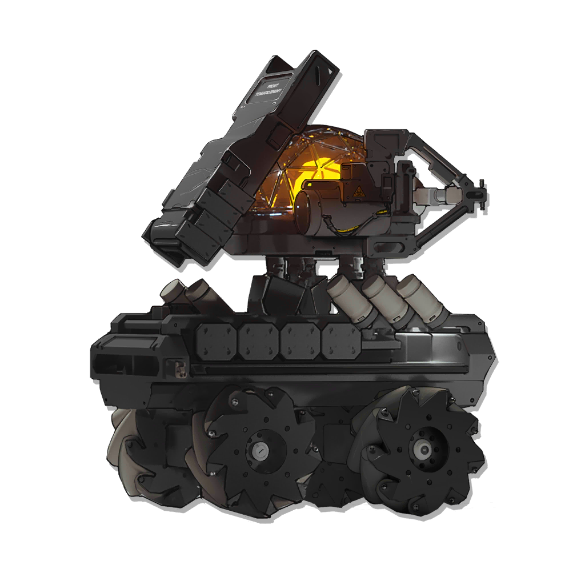
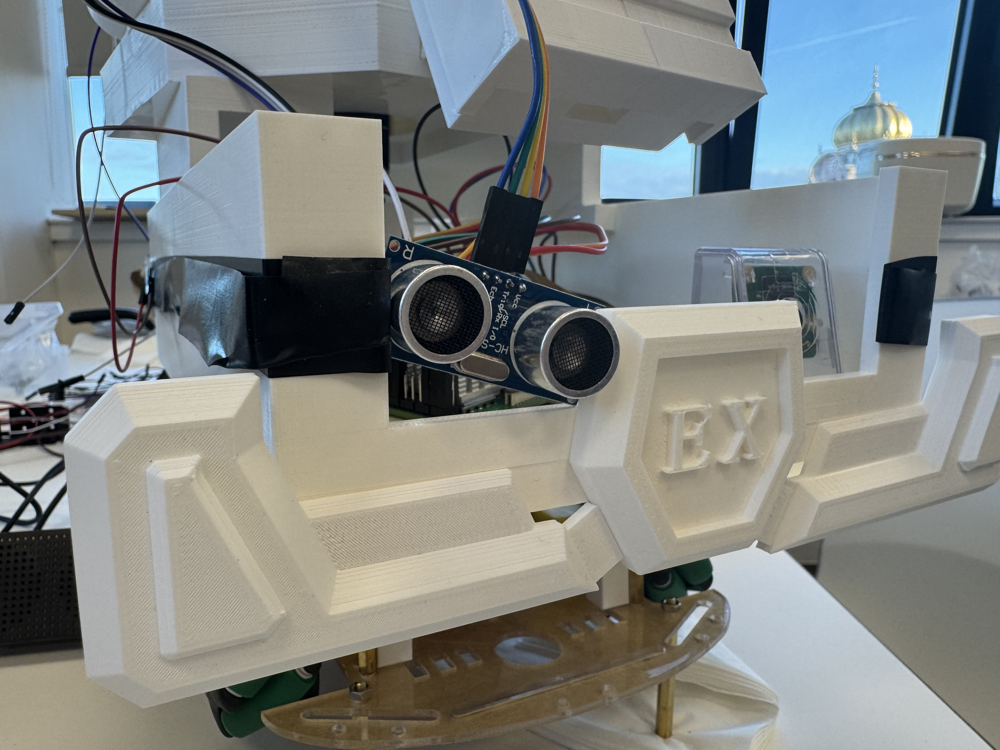

# Thermal-EX

<p align="center">
<a href="https://ak.hypergryph.com/">
  
</a>

</p>
<h3 align="center">Welcome back, Doctor! I see that you're also full of light and heat today!</h3>

<br />
<p align="center">
  <a href="https://github.com/ShinZ0531/Thermal-EX/blob/main/LICENSE"></a>
  <a href="https://github.com/ShinZ0531/Thermal-EX/releases"></a>
  <br/>
</p>

<hr class="solid">

[看中文版走这里](README_ZH.md)  


In this project, we are ready to use Raspberry Pi 5 to make a smart robot based on Thermal-EX, a character from game Arknights. He's a enthusiastic robot, ready to help you anywhere and anytime. We want to use this way for building the connection with the fan groups of this game, makeing fun for them who are love this game deeply.   

### Watch our video demo
Finished product function demonstration:   

Early function demonstration:   
[](https://www.youtube.com/watch?v=FJetTLFNYLg)

or bilibili→
[老大说4月前看不到视频就不让我玩太刀喵](https://www.bilibili.com/video/BV16FZzYbERi) (bilibili link)

### Functions in plan

Add microphone and speaker for better interaction.

Add camera for face recognition.

 

## 📜 How to use

```cmake
mkdir build
cd build
cmake .. -DCMAKE_BUILD_TYPE=Release
make -j
```

In the build folder, you can see many executable files. For specific functions, please refer to the README.md or wiki under the src folder.

## 📦 version

### Released Edition
#### 2.3.0
In this version, the SG90 servo has been added to drive the head to rotate (rotate!) And more, including Keyboard input monitoring class and audio class using usb speakers.

In addition, there is an integrated function that combines the HCSR04 ultrasonic sensor, LED and SG90 servo: When the distance detected by the ultrasonic wave is less than the threshold, the LED will flash faster as a warning, and at the same time the servo will stop - Thermal-EX will start to stare in this direction!

The 3D printed shell has also been basically completed, and the lovely Thermal-EX has taken shape initially.

#### 2.2.0
Add callback interfaces to the LED and HCSR04 ultrasonic sensors. Each function has a separate test.

#### 2.0.0
The first released edition! It offers two main functions, LED light blinking and ultrasonic ranging.

#### 2.2.0
Add callback for LED and HCSR04 ultrasonic sensor. Provide individual tests for each function.


### Unreleased Edition
#### 1.0.0
Print logo of original game and THRM-EX.  
#### 1.1.0
Add new function about light on and off.  
#### 1.2.0
Using libgpio to control the GPIO, instead of ~~antique~~ wiringPi. Add Doxygen comments.  
#### 1.3.0
New function about ultrasonic, but wiringPi.  
#### 1.4.0
Ultrasonic ranging, using libgpio instead of wiringPi. Finally! 
#### 2.1.0
Make some code adjustment.

## 😙 Contribute
<table>
  <tr>
    <td width="150" align="center">
      <a href="https://github.com/ShinZ0531">
        
      </a>
    </td>
    <td>
      <div style="position: relative; padding: 15px; background: #f0f2f5; border-radius: 10px; margin: 10px 0;">
        <div style="position: absolute; left: -10px; top: 20px; width: 0; height: 0; border-top: 10px solid transparent; border-bottom: 10px solid transparent; border-right: 10px solid #f0f2f5;"></div>
        <strong>Jin Zhou</strong>: JUST DO IT
        <br>
        <em>Managed project timelines, code updates, and documentation</em>
      </div>
    </td>
  </tr>

  <tr>
    <td align="center">
      <a href="https://github.com/Cliay193">
        
      </a>
    </td>
    <td>
      <div style="position: relative; padding: 15px; background: #f0f2f5; border-radius: 10px; margin: 10px 0;">
        <div style="position: absolute; left: -10px; top: 20px; width: 0; height: 0; border-top: 10px solid transparent; border-bottom: 10px solid transparent; border-right: 10px solid #f0f2f5;"></div>
        <strong>Juekun Jiang</strong>: crazy Thursday v me 50
        <br>
        <em>Developed hardware, such as motor drivers

  implemented HCSR04 ultrasonic sensor and motor driver code
  Assisted in device assembly</em>
      </div>
    </td>
  </tr>

  <tr>
    <td align="center">
      <a href="https://github.com/Dreamshrimp-gg">
        
      </a>
    </td>
    <td>
      <div style="position: relative; padding: 15px; background: #f0f2f5; border-radius: 10px; margin: 10px 0;">
        <div style="position: absolute; left: -10px; top: 20px; width: 0; height: 0; border-top: 10px solid transparent; border-bottom: 10px solid transparent; border-right: 10px solid #f0f2f5;"></div>
        <strong>Xiaxi Li</strong>: If you dare mess with me, you're picking on cotton.
        <br>
        <em>Handled promotions and video production
        
  Built foundational camera control code</em>
      </div>
    </td>
  </tr>

  <tr>
    <td align="center">
      <a href="https://github.com/ninuin11">
        
      </a>
    </td>
    <td>
      <div style="position: relative; padding: 15px; background: #f0f2f5; border-radius: 10px; margin: 10px 0;">
        <div style="position: absolute; left: -10px; top: 20px; width: 0; height: 0; border-top: 10px solid transparent; border-bottom: 10px solid transparent; border-right: 10px solid #f0f2f5;"></div>
        <strong>Ziyuan Liu</strong>: Rhode Island Demolition Engineer
        <br>
        <em>Led 3D printing and hardware assembly
        
  Completed SG90 servo motor code    
  Published promotional videos</em>
      </div>
    </td>
  </tr>

  <tr>
    <td align="center">
      <a href="https://github.com/成员B账号">
        
      </a>
    </td>
    <td>
      <div style="position: relative; padding: 15px; background: #f0f2f5; border-radius: 10px; margin: 10px 0;">
        <div style="position: absolute; left: -10px; top: 20px; width: 0; height: 0; border-top: 10px solid transparent; border-bottom: 10px solid transparent; border-right: 10px solid #f0f2f5;"></div>
        <strong>Han Jiang</strong>: OFFLINE
        <br>
        <em>Assisted in 3D printing tasks</em>
      </div>
    </td>
  </tr>

  
</table>

## ✈️ Timeline
`📅 2025.02.06 -> 2025.02.16` **Project launch**  
🟦⬜⬜⬜⬜⬜⬜⬜⬜⬜⬜⬜⬜⬜ 10%
- Set a goal and build an smart car  
- The theme is the Arknights character Thermal-EX 
<br>  

`📅 2025.02.17 -> 2025.02.23` **Project Planning **  
🟦🟦⬜⬜⬜⬜⬜⬜⬜⬜⬜⬜⬜⬜ 20%
- Function division: Motor and drive, voice playback, 3D printed housing, camera, ultrasonic, lighting  
- 分工并寻找可用参考  
<br>  

`📅 2025.02.24 -> 2025.03.09` **Start trying**  
🟦🟦🟦🟦⬜⬜⬜⬜⬜⬜⬜⬜⬜⬜ 30%  
- Establish norms for the use of GitHub repositories and code writing  
- Start writing code
- 3D printing begins to draw
<br> 

`📅 2025.03.10 -> 2025.03.23` **Preliminary finished**  
🟦🟦🟦🟦🟦🟦🟦🟦⬜⬜⬜⬜⬜⬜ 50%  
- Study c++ class programming  
- The LED class and the ultrasonic sensor class based on HCSR04 have been initially completed  
- Determine the sensors and other components to be used next  
- Try 3D printing and modify the expected size  
- Promote the current functions  
<br> 

`📅 2025.03.24 -> 2025.03.30` **Halftime break**  
🟦🟦🟦🟦🟦🟦🟦🟦🟦⬜⬜⬜⬜⬜ 55%  
- Rest and adjust
<br> 

`📅 2025.03.31 -> 2025.04.13` **Frustration phase**  
🟦🟦🟦🟦🟦🟦🟦🟦🟦🟦🟦🟦⬜⬜ 75%  
- Try to solve the problem that the motor-driven TB6612 and L298N and the motor cannot be used  
- Try to solve the problem that ov5647 cannot be used  
- Try to solve the problem of being unable to call imx219  
- Try using I2S  
- Adjust the project schedule  
- 3D printed shell  
<br> 

`📅 2025.04.14 -> 2025-04-21` **Project submission**  
🟦🟦🟦🟦🟦🟦🟦🟦🟦🟦🟦🟦🟦🟦 100%  
- Adjust the code structure  
- Add the SG90 servo with pwm control, keyboard input monitoring and audio output classes  
- An example of a complex function has been integrated  
- 3D printed shell  
- Assemble the finished products  
- Carry out the promotion of the final version    
<br> 

## 💬 Reference
Use the PWM control repository from [rpi_pwm](https://github.com/berndporr/rpi_pwm)

## ⚖️ License

This project is under the Apache 2.0 License. See the [LICENSE](https://github.com/ShinZ0531/Thermal-EX/blob/main/LICENSE) file for the full license text.