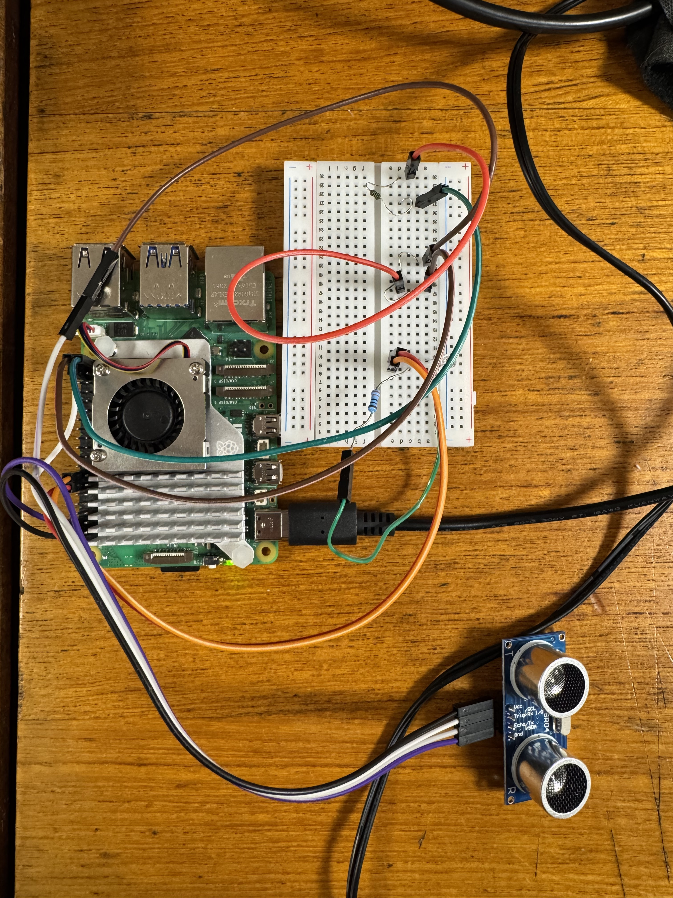
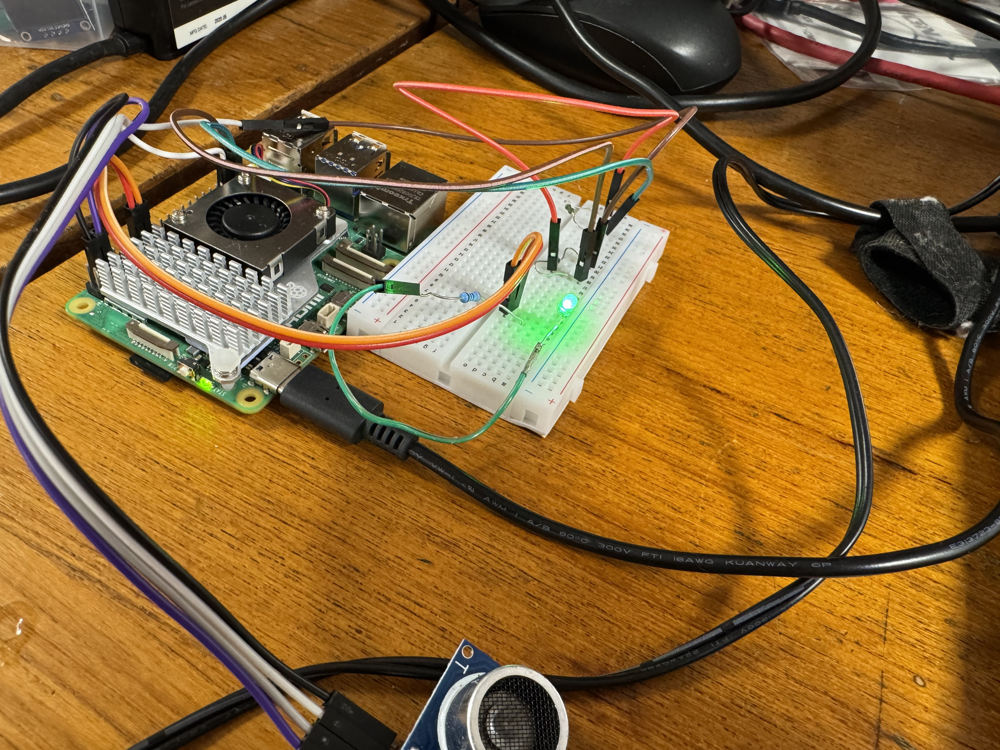

# Thermal-EX

<p align="center">
<a href="https://ak.hypergryph.com/">
  
</a>

</p>
<h3 align="center">Welcome back, Doctor! I see that you're also full of light and heat today!</h3>

<br />
<p align="center">
  <a href="https://github.com/ShinZ0531/Thermal-EX/blob/main/LICENSE"></a>
  <a href="https://github.com/ShinZ0531/Thermal-EX/releases"></a>
  <br/>
</p>

<hr class="solid">

[简体中文](README_ZH.md)  


In this project, we ready to make a smart car based on Thermal-EX, a character from game Arknights. He's a enthusiastic robot, ready to help you anywhere and anytime. We want to use this way for building the connection with the fan groups of this game, makeing fun for them who are love this game deeply.   
It is a basic prototype. We plan to add more functions in the furture.  
  
## 📜 How to use

```cmake
mkdir build
cd build
cmake .. -DCMAKE_BUILD_TYPE=Release
make -j
```
Here are two main functions now.  
**./light**: It will print the logo of Arknights and Thermal-EX and say hi to you, then the LED light will start to blink slowly.  
  
**./Ultrasonic**: We can use ultrasonic sensor to measure the distance and show it on the screen! Meanwhile, the time and the value can be recorded in the file, so in the furture we can analyze these data.  

## 📦 version

### Released Edition
#### 2.0.0
The first released edition! It offers two main functions, LED light blinking and ultrasonic ranging.

### Unreleased Edition
#### 1.0.0
Print logo of original game and THRM-EX.  
#### 1.1.0
Add new function about light on and off.  
#### 1.2.0
Using libgpio to control the GPIO, instead of ~~antique~~ wiringPi. Add Doxygen comments.  
#### 1.3.0
New function about ultrasonic, but wiringPi.  
#### 1.4.0
Ultrasonic ranging, using libgpio instead of wiringPi. Finally! 

## ⚖️ License

This project is under the Apache 2.0 License. See the [LICENSE](https://github.com/ShinZ0531/Thermal-EX/blob/main/LICENSE) file for the full license text.