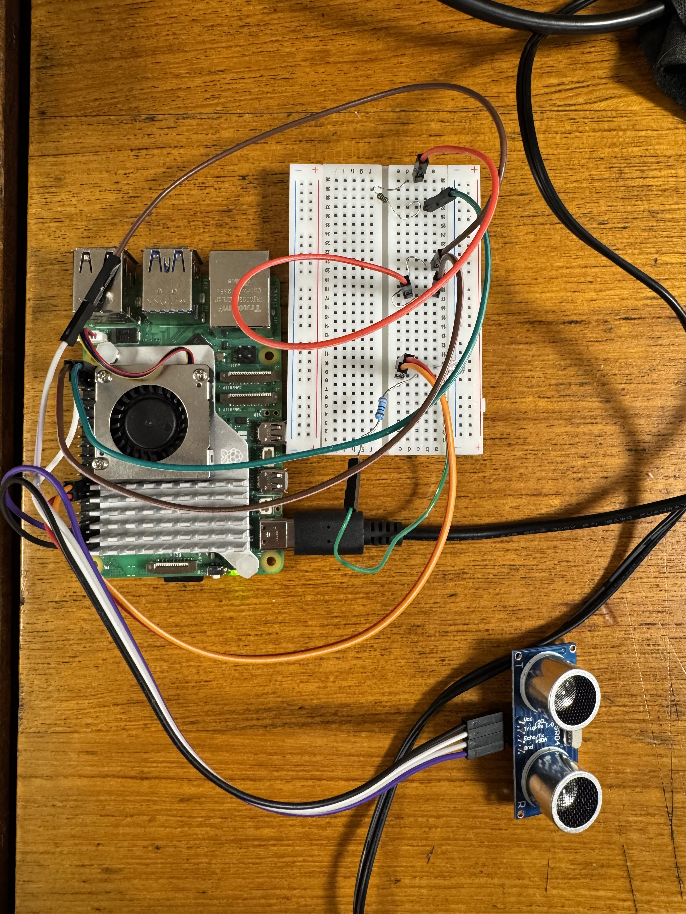
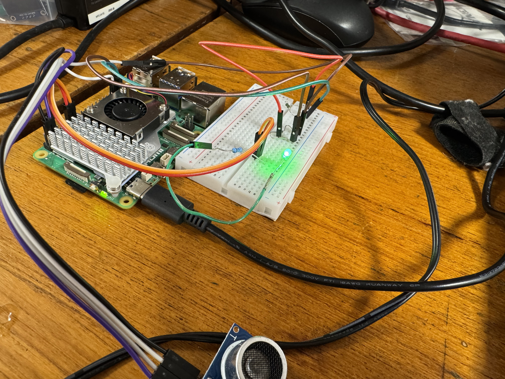

# Thermal-EX

<p align="center">
<a href="https://ak.hypergryph.com/">
  
</a>
</p>
<h3 align="center">欢迎回来，博士！今天您也是如此充满着光与热啊！</h3>

<br />
<p align="center">
  <a href="https://github.com/ShinZ0531/Thermal-EX/blob/main/LICENSE"></a>
  <a href="https://github.com/ShinZ0531/Thermal-EX/releases"></a>
  <br/>
</p>

<hr class="solid">


[English](README.md)  

在这个项目，我们打算基于Thermal-EX制作一个智能小车，Thermal-EX是游戏《明日方舟》中的一个角色，非常热情，时刻准备着给予你帮助。我们希望通过这种方式来让更多的人感受到这个角色的有趣之处，用智能小车Thermal-EX给大家带来笑容。  
现在还是一个早期原型，我们计划在未来加入更多功能。  
  
## 📜 如何使用

```cmake
mkdir build
cd build
cmake .. -DCMAKE_BUILD_TYPE=Release
make -j
```
现在主要有实现了两个功能。
**./light**：它会打印出明日方舟和Thermal-EX的图标，并输出Thermal-EX的几句台词，同时LED小灯会开始闪烁。   
  
**./Ultrasonic**：我们使用超声波传感器来测量距离，并打印在屏幕上！同时，时间和计算出来的距离会被记录在单独的文件里，以供后期数据分析。

## 📦  版本

### 发行版
#### 2.0.0
第一个正式发行的版本！它提供了两个主要功能，LED灯闪烁和超声波测距。

### 未发行版
#### 1.0.0
打印游戏和Thermal-EX的logo。  
#### 1.1.0
灯闪烁的新功能。  
#### 1.2.0
使用libgpio来控制GPIO，而不是~~古老的~~wiringPi。  
#### 1.3.0
关于超声波的新功能，但还是使用wiringPi。
#### 1.4.0
超声波测距，但是使用libgpio而不是wiringPi。终于啊终于！


## ⚖️ 证书

这个项目使用Apache 2.0证书。在这里查看[证书](https://github.com/ShinZ0531/Thermal-EX/blob/main/LICENSE)。